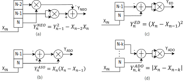
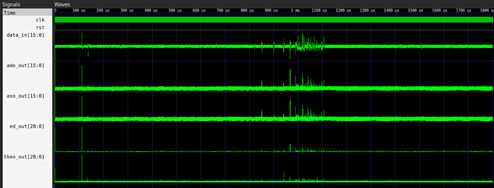
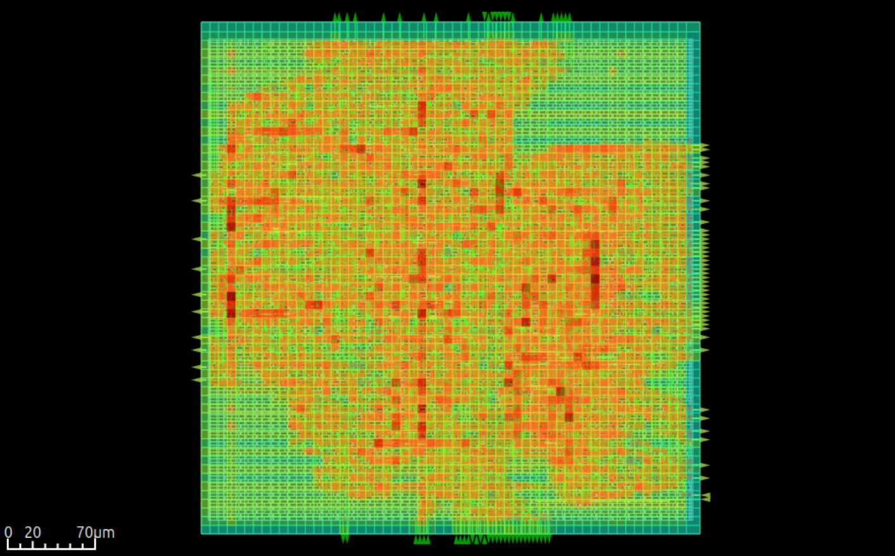

# non-linear-signal-operators

Repository implementing various signal operators for the signal to noise ratio enhancement of noisy signals

## Overview

This repository contains RTL implementations and a verification suite for various non-linear signal processing operators. These operators—TKEO, ED, ASO, and ADO—are specifically designed to emphasize transients, track instantaneous energy, and detect spikes in noisy time-series data, such as Local Field Potential (LFP) or EEG recordings.

Unlike linear filters (FIR/IIR), these operators utilize non-linear transformations to improve the signal-to-noise ratio (SNR) of specific features, making them ideal for real-time neuromorphic sensing and low-power VLSI feature extraction.

## Supported Operators

| Operator | Full Name | Mathematical Logic | Best Use Case |
|----------|-----------|-------------------|----------------|
| TKEO | Teager-Kaiser Energy Operator | `ψ[n] = x²[n] - x[n-1]x[n+1]` | Instantaneous energy tracking |
| ED | Energy of Derivative | `ψ[n] = (x[n] - x[n-k])²` | High-frequency transient detection |
| ASO | Amplitude Slope Operator | `ψ[n] = \|x[n] - x[n-k]\|` | Slope change / Velocity tracking |
| ADO | Amplitude Difference Operator | `ψ[n] = \|x[n] - x[n-k]\|` | Robust amplitude shift detection |

The block diagram below illustrates the signal processing pipeline for each operator. In the Figure, the (A) is for the NEO operator, (B) for the ASO operator, (C) for the ED operator and (D) for the ADO operator. 



## Key Features

- **Parallel Architecture**: Top-level wrapper (`operators_top.v`) for simultaneous processing of all operators
- **Pipelined Design**: Fully pipelined RTL optimized for high-frequency FPGA/ASIC synthesis
- **Parametric Widths**: Configurable input/output bit-widths and scaling factors (Q-format friendly)
- **Dual Verification**: Cycle-accurate Verilog testbenches and data-driven cocotb verification

## Installation

### System Tools (Ubuntu / Debian)
```bash
sudo apt update
sudo apt install -y iverilog gtkwave make
```

### Setup Python Environment

Ensure you have Poetry installed. Then, run the following in the project root:

```bash
# Install dependencies into a virtual environment
poetry install

# Activate the virtual environment
poetry shell
```

## Running Simulations

The project includes a unified Makefile at the root level that provides convenient targets for both Verilog and cocotb simulations.

### Verilog Simulation (Icarus Verilog & GTKWave)

The Verilog testbench provides cycle-accurate simulation and waveform visualization.
The testbench is located at `tb/verilog/tb_operators.v`.

**Run simulation and view waveforms (default):**
```bash
make test
```

**Or run steps individually:**
```bash
# Run Verilog testbench
make test-verilog

# View waveforms in GTKWave
make view-verilog
```

The waveforms will be displayed in GTKWave with a pre-configured layout (`operators_wave.gtkw`) that shows all operator signals.

### cocotb Verification (Python-Driven Analysis)

The cocotb testbench automates functional verification against a Python reference model. The cocotb testbench is located at `tb/cocotb/test_operators.py` and tests the operators with different simulated signals.

**Run cocotb tests:**
```bash
make test-cocotb
```

**View cocotb waveforms:**
```bash
make view-cocotb
```

**Run both cocotb test and view (legacy):**
```bash
make test-cocotb-legacy
```


### LibreLane

This project supports automated ASIC synthesis using the [LibreLane](https://github.com/darthlamprey/librelane) flow with the Skywater 130nm (SKY130) PDK. The `librelane/config.json` specifies the configuration, mapping the Verilog operators to the standard cell library.

To run the full synthesis and place-and-route flow:
```bash
make librelane
```

After the flow completes, the synthesized macro can be visualized in the OpenROAD GUI:
```bash
make view-openroad
```


*Synthesized layout of the non-linear signal processing operators.*

## Conclusion

This suite provides a modular toolkit for non-linear signal conditioning, ideal for edge-computing applications requiring low-latency feature extraction. This is typically used for local field potentials in EEG and ECOG applications.
